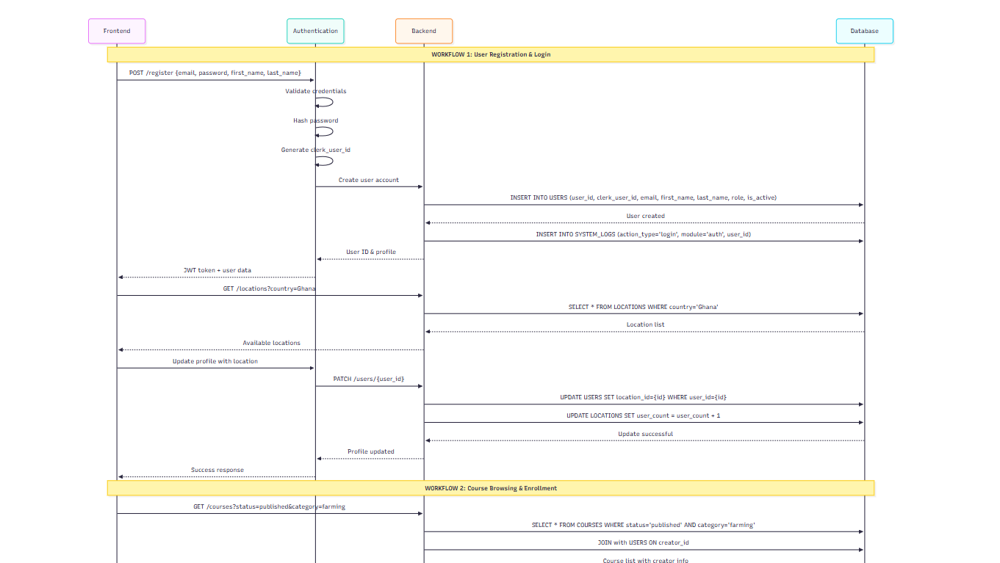

 ## Farmlingo Backend (Node.js/TypeScript API)

A clean, modular, and scalable Node.js backend starter for the Farmlingo platform.
This backend provides a solid foundation with routing, middleware, environment configuration, and a built-in `/health` status endpoint.

---

##  What This Backend Includes

* Modular Express architecture
* Health check endpoint (`/health`)
* Built-in middleware: **helmet**, **cors**, **morgan**
* Centralized configuration via `.env`
* Error-handling middleware
* Lightweight logger utility
* Ready-to-use folder structure

---

# 1. Requirements

Make sure the following are installed before setting up the backend:

* **Node.js 16 or later**
* **npm**

---

#  2. Installation & Setup

Follow these steps to get the backend running locally.

---

## **Step 1 — Clone the project**

```bash
git clone <your-repo-url>
cd farmlingo_backend-API
```

---

## **Step 2 — Install dependencies**

```bash
npm install
```

---

## **Step 3 — Configure environment variables**

Create a `.env` file in the project root with values like:

```env
# Database (Neon Serverless)
DATABASE_URL=postgresql://<user>:<password>@<neon-host>/<db>?sslmode=require

# Auth
JWT_SECRET_KEY="change-me"
JWT_EXPIRES_IN=1h

# App Config
PORT=4002
NODE_ENV=development
APP_NAME=farmlingo-backend
API_VERSION=1.0.0
API_BASE_URL=http://localhost:4002/api

# Health defaults (optional)
HEALTH_OK_MESSAGE=ok
HEALTH_DB_STATUS=ok
HEALTH_CACHE_STATUS=ok
HEALTH_EXTERNAL_API_STATUS=ok
HEALTH_MESSAGE_BROKER_STATUS=ok
```

---

## **Step 4 — Run the backend**

### Development (with nodemon + ts-node)

```bash
npm run dev
```

### Production build

```bash
npm run build
npm start
```

The backend will start on the port specified in `.env` (default: **4002**).

Common URLs:

- **Root:** http://localhost:4002/
- **Health check:** http://localhost:4002/api/health
- **Users (secured):** http://localhost:4002/api/users (requires Bearer token)

---

# 🩺 3. Health Check Endpoint

The backend includes an `/api/health` route that returns the current server and dependency status.

### **GET /api/health**

### Example Response:

```json
{
  "status": "ok",
  "message": "ok",
  "uptime_seconds": 76,
  "version": "1.0.0",
  "timestamp": "2025-11-16T18:36:56.021Z",
  "env": "development",
  "details": {
    "database": "ok",
    "cache": "ok",
    "externalApi": "ok",
    "messageBroker": "ok"
  },
  "system": {
    "platform": "win32",
    "cpu_count": 8,
    "memory_total": 8265981952
  }
}
```

Use this endpoint to verify the backend is running successfully.

---

# 4. Project Structure

```
farmlingo_backend-API/
│
├── server.ts                # App entry point (TypeScript)
├── dist/                    # Compiled JS output (after `npm run build`)
├── .env                     # Environment variable configuration
├── src/
│   ├── app.ts               # Express app setup + middleware
│   ├── routes/              # API route definitions
│   ├── controllers/         # Functions that respond to requests
│   ├── middlewares/         # Custom middleware (logger, errors)
│   └── config/              # Environment config handling
├── utils/
│   └── logger.ts            # Lightweight logger utility
├── package.json
├── tsconfig.json
└── README.md
```

---

# 5. How to Use the Backend

### **Built-in endpoints**

- **GET /** → basic service status message.
- **GET /api/health** → detailed health and dependency status.
- **GET /api/users** → list users (secured; requires `Authorization: Bearer <token>`).

### **Add new routes**

Create a file in:

```
src/routes/
```

Register the route in `src/routes/index.ts` (mounted under `/api`).

### **Add controllers**

Add logic inside:

```
src/controllers/
```

### **Add middleware**

Place reusable middleware inside:

```
src/middlewares/
```

### **Update config values**

Modify environment settings inside `.env`.

---

# 6. Quick Testing

After starting the backend:

```bash
curl http://localhost:4002/api/health
```

Expected output:
A JSON object containing `"status": "ok"`.

---

# 7. Database: Drizzle ORM + Neon PostgreSQL

This project uses Drizzle ORM with a Neon PostgreSQL database.

- Connection string is provided via `DATABASE_URL` in `.env`.
- Schema is defined in TypeScript under `src/db/schema.ts`.
- Drizzle ORM is used at runtime via `src/db/dbconfig.ts` (Neon HTTP driver).

## 7.1. Provision a Neon database

1. Create a database on https://neon.tech
2. Copy your connection string (ensure `sslmode=require`).
3. Set it in `.env`:

```env
DATABASE_URL=postgresql://<user>:<password>@<neon-host>/<db>?sslmode=require
```

## 7.2. Apply the schema to the database

Use Drizzle Kit to push the schema defined in `src/db/schema.ts` to your Neon database:

```bash
npm run db:push
```

Optionally, open Drizzle Studio to inspect tables:

```bash
npm run db:studio
```

Note: If Drizzle complains about missing config, create a minimal `drizzle.config.ts` in the project root:

```ts
import type { Config } from 'drizzle-kit';

export default {
  schema: './src/db/schema.ts',
  out: './drizzle',
  dialect: 'postgresql',
  dbCredentials: {
    url: process.env.DATABASE_URL as string,
  },
} satisfies Config;
```

## 7.3. Database ERD

The ERD visualizes the relationships across users, courses, lessons, enrollments, forums, chat, quizzes, and related entities.


If the embedded images do not render, you can view the ERD directly using the link below:

[**Direct ERD Link**](https://www.mermaidchart.com/d/19917d20-e7c7-413a-ba1a-070b1c446c34)


---

# 8. Environment configuration

Create a `.env` file at the project root. Example (matches this repo’s usage):

```env
# Database (Neon Serverless)
DATABASE_URL=postgresql://<user>:<password>@<neon-host>/<db>?sslmode=require

# Auth
JWT_SECRET_KEY="change-me"

# App Config
PORT=4002
NODE_ENV=development
APP_NAME=farmlingo-backend
API_VERSION=1.0.0

# Health defaults (optional)
HEALTH_OK_MESSAGE=ok
HEALTH_DB_STATUS=ok
HEALTH_CACHE_STATUS=ok
HEALTH_EXTERNAL_API_STATUS=ok
HEALTH_MESSAGE_BROKER_STATUS=ok
```

---

# 9. Running the project

## 9.1. Development

```bash
npm run dev
```

Starts Nodemon with ts-node. Logs will include the full server URL and Swagger UI.

## 9.2. Production

```bash
npm run build
npm start
```

Runs the compiled JavaScript from `dist/`.

---

# 10. API Documentation (Swagger)

- Swagger UI: `http://localhost:<PORT>/api-docs/#/` (example: http://localhost:4002/api-docs/#/)
- OpenAPI JSON: `http://localhost:<PORT>/api-docs.json`

Tags are ordered as:

1. Health
2. Users
3. Courses
4. Lessons
5. Enrollments
6. Forums
7. Chat

---

# 11. Authentication

Protected endpoints use Bearer JWTs. Obtain a token via the login route, then pass it as `Authorization: Bearer <token>`.

Example login (multipart/form-data):

```bash
curl -X POST http://localhost:4002/api/users/login \
  -H "Content-Type: multipart/form-data" \
  -F email=test@example.com
```

Use the returned `access_token` for subsequent requests:

```bash
curl http://localhost:4002/api/courses \
  -H "Authorization: Bearer <ACCESS_TOKEN>"
```

---

# 12. Sending data as multipart/form-data

Create/Update endpoints now expect `multipart/form-data` for field-only forms. Send JSON-like fields as strings; the server will parse them.

Examples:

- Create course
```bash
curl -X POST http://localhost:4002/api/courses \
  -H "Authorization: Bearer <ACCESS_TOKEN>" \
  -H "Content-Type: multipart/form-data" \
  -F title="Intro to Hydroponics" \
  -F category=hydroponics \
  -F creator_id="<uuid>"
```

- Create lesson with metadata
```bash
curl -X POST http://localhost:4002/api/lessons \
  -H "Authorization: Bearer <ACCESS_TOKEN>" \
  -H "Content-Type: multipart/form-data" \
  -F course_id="<uuid>" \
  -F title="Nutrient Solutions" \
  -F metadata='{"difficulty":"easy"}'
```

- Create forum post with tags
```bash
curl -X POST http://localhost:4002/api/forums/<forumId>/posts \
  -H "Authorization: Bearer <ACCESS_TOKEN>" \
  -H "Content-Type: multipart/form-data" \
  -F user_id="<uuid>" \
  -F title="How to prevent root rot?" \
  -F content="I noticed some of my plants have root rot..." \
  -F tags='["help","hydroponics"]'
```

---

# 13. Available scripts

- `npm run dev` — start dev server (nodemon + ts-node)
- `npm run build` — TypeScript compile
- `npm start` — run compiled server from `dist`
- `npm run lint` — run ESLint
- `npm run db:push` — apply schema to DB using Drizzle Kit
- `npm run db:studio` — open Drizzle Studio

---

# 14. Troubleshooting

- Port already in use: change `PORT` in `.env` (e.g., 4002).
- JWT errors: ensure `JWT_SECRET_KEY` is set and consistent between login and protected calls.
- Database connection: verify `DATABASE_URL` and SSL requirement in Neon.
- Swagger not updating: hard refresh the page; confirm `src/config/swagger.ts` and route JSDoc tags.

---

# 15. Sequence Diagram

The following sequence diagram visualizes major flows across authentication, courses, forums, chat, reports, and weather data.



If it does not render in your viewer, open the file directly at [Direct ERD Link](https://www.mermaidchart.com/d/3668fe9a-9bf9-4a26-85c9-d106d2e41cf4).

## 16. Render Deployment

You can access the Swagger UI for the Farmlingo backend here:  
[Open Swagger UI](https://farmlingo-backend-swagger.onrender.com/api-docs/#/)


